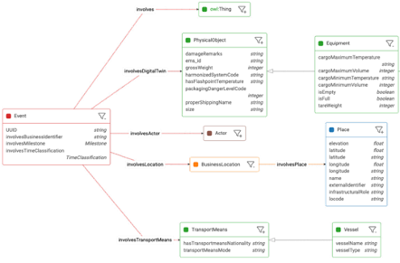

# Overview

1 **Summary**

&#x20;Over time, different sectors have developed their own ‘language’ to communicate about their activities. This is illustrated by the number of global and local standards. It is expected that data spaces should align with sectors and their standards, creating the need for tools for organizations that participate in multiple data spaces to switch between standards.

**2 Purpose of the building block**

&#x20;The purpose of this building block is to describe the creation and usage of a light-weight common BDI format, called LEO (Logistics Event Ontology). The purpose of this format is to bridge the existing standards in the realm of logistics data sharing, like OTM, FEDeRATED, OneRecord, DCSA, GS1, UN/CEFACT, EDIFACT and many others. It is not the intention to fully map all details of all standards on a single model. Instead, the LEO format distils the minimal data needed to follow goods through the supply chain based on the perspective of the beneficial cargo owner (BCO).

**3 Concepts**

&#x20;Three distinct levels or perspectives exists from which one can consider the logistics domain, based on the three layers of the DCSA model:

1\.        Transport: The movements of the transport means containing equipment which contains the goods. Like vessel, barge, ship, truck, airplane, etc.

2\.        Equipment: The movements of the actual equipment containing the goods. Like container, parcel, trailer, package, loading, pick up, delivery, eta, etc.

3\.        Shipment: The business transactions along the supply chain. Like bill of lading, airway bill, customs documents, clearances, certificates, etc.

The LEO format is primarily focused on the first two physical perspectives and builds on the semantic work done in de FEDeRATED projects.

4 **Implementation Considerations**

&#x20;In creating this minilanguage, we should avoid reinventing the wheel. We achieve this by keeping close to existing standards. The most effective way to do this would be to pick a small number of modelling elements from a small number of carefully selected models.

These models should be widely used and well-understood, relatively simple, and, taken together, support the target use cases concerning supply chain visibility for BCOs. The challenge, however, is: how can we not only keep our minilanguage simple, but also ensure that mapping datapoints from existing messages in terms of dozens of languages is viable? The answer is to make pervasive use of code lists and thesauri.

&#x20;Beneficial cargo owners (BCOs) greatly profit from this information allowing them to

track and trace their cargo. Unfortunately, different subdomains in the logistics industry use vastly different languages to express such information. The unwanted result is that many BCOs suffer from an inadequate information position. Hence the need for an intermediary language as a solution.

**5 Interlinkages with other building blocks**

&#x20;This building block is closely linked with the Event Publish-Subscribe Service. The LEO format is mostly geared towards the description of events and the minimal data needed to communicate between modalities and existing standards. It defines templates for often used common logistic events and their linkage to domain standards.

&#x20;**6 Elements and their key functions**

&#x20;According to EPCIS (ISO/IEC 19987) an Event contains at least the following 5 aspects: 'What, Where, When, Why and How'.

•            What: To which object or entity does this Event primarily relate (e.g. pallet, order, truck, wagon, etc.)?

•            Where: At which location did the event take place (warehouse receipt door, terminal access)?

•            When: On what date and time did the event take place?

•            Why: Why (in which business activity exactly) did the event take place (goods receipt, freight collection, transport document definitively agreed, etc.)?

•            How: It may also include the 'How' aspect. In what state (how) are or was the cargo being transported at the time of the event?

<figure><figcaption>
A FEDeRATED example event and attached data
</figcaption></figure>

The example figure above, brings together the ideas of Event-Driven as also used in FEDeRATED and the EPCIS standard (which is almost 20 years old and used in practice in transport, logistics and supply chain). The Event is central in the figure, it is linked to a location (Where), to a logistics service (Why) and to a (physical) object (What).

&#x20;The semantic model of the Event, expressed in RDF in the figure, also has a date and time. Since there are also quite a few connections beyond the figure's boundary, it will be clear that the Event-Driven semantic model can be extended to any level.

&#x20;**7 Core design decisions**

&#x20;The LEO format is still under development.

&#x20;**8 Future topics**

We are not the only party looking for minimalistic logistics formats to create multi-modal supply chain visibility in conjunction with the many logistic domain standards now in practice. There are several commercial platforms creating this function already.

Several of them are completely open and have published and maintained formats like this for years. Much like the successful creation of the OTM standard, they are based on operational pragmatism and have been tested in practice.

We see them as excellent starting points for the format we are trying to define. A good example is Shippeo’s Real-Time Transportation Visibility Platform service with [https://api-doc.shippeo.com/](https://api-doc.shippeo.com/) as an open data model and API format.

&#x20;**9 Further reading**

&#x20;The choices made for this building block are based on the following research:

&#x20;·      [https://bdinetwork.org/wp-content/uploads/2024/01/2024-BDI-Developing-Semantics-for-Supply-Chain-Transport-Logistics.pdf](https://bdinetwork.org/wp-content/uploads/2024/01/2024-BDI-Developing-Semantics-for-Supply-Chain-Transport-Logistics.pdf)

&#x20;·      [https://www.federatedplatforms.eu/index.php/federated-semantic-interoperability](https://www.federatedplatforms.eu/index.php/federated-semantic-interoperability)

&#x20;·      LEO: THE LOGISTICS EVENT ONTOLOGY. A generic “minilanguage” for sharing information across domains, BDI Architecture Board

&#x20;·      Selection of a base model for LEO, BDI Architecture Board

&#x20;·      Semantic model development, BDI Architecture Board

&#x20;

&#x20;

&#x20;

