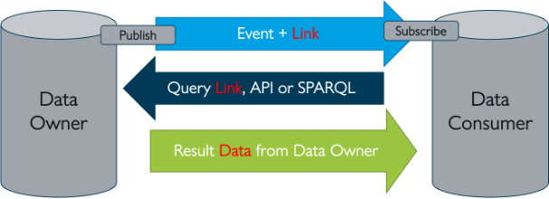

# Event Pub/Sub Service

**1 Summary**

The semantic model introduces essential new terms, namely several ‘events’: from planned to executed events. Events are the digital representation of the result of an action in the physical world: for example, ‘expected arrival time issued’, ‘container has been unloaded’. So, an event is the result of actions, not the action itself.

Take the event that a full container has been loaded onto a container ship in China. All parties involved in the Netherlands, from the port authority, the container terminal, forwarders/processors, Customs, hinterland transporters to the shipper that ordered the goods, want to track the status of the ship and this container from that moment onwards. And they create events because of this knowledge: a declaration, reservation of capacity, etc.

The concept of the BDI is that parties involved can subscribe to main events and the ‘daughter’ events: they receive new updates, a new status, and new events. If required (and permitted) a party can request more data from the source. The concept of events and subscribing to them is broadly applicable: take the schedule for a building site for example. It is highly effective for all the suppliers and subcontractors if new things or changes to the schedule are automatically identified.

**2 Purpose of the building block**

‘Event-driven’ communication is a way of restructuring the logistics of the information exchange between the IT systems of companies. Instead of a data owner sending messages when something of importance needs to be communicated (‘fire and forget’, ‘messaging’), all parties involved receive a signal (‘event’) from the data owner that something relevant has happened (‘publish event to subscribers’).&#x20;

That event contains metadata and a link to the source of the data. The receiving party evaluates the metadata and decides whether to follow the link to the source and access the data.

<figure><figcaption></figcaption></figure>

The Event Pub-Sub Service handles the centralized parts of this event-based communication. The actual data exchange happens directly between the parties in a federated manner.&#x20;

**3 Concepts**

An event-driven architecture uses events to trigger and communicate between decoupled services and is common in modern applications built with microservices. An event is a change in state, or an update, like an item being placed in a shopping cart on an e-commerce website.

Events can either carry the state (the item purchased, its price, and a delivery address) or events can be identifiers (a notification that an order was shipped).

Event-driven architectures have three key components: event producers (BDI: Data Owners), event routers (BDI: Event Pub-Sub Services), and event consumers (BDI: Data Consumers).

A producer publishes an event to the router, which filters and pushes the events to consumers. Producer services and consumer services are decoupled, which allows them to be scaled, updated, and deployed independently.

This approach has many advantages:

Efficiency:

* no polling needed.
* low load on resources.

Effectiveness:

* easy to distribute to many parties involved.
* ‘single truth’ data at the source.
* synchronization of activities.

Control:

* distributing events with metadata reveals relatively little information that can be abused for criminal purposes.
* any party who wishes to access data can only do so by authenticating themselves at the source.
* authorization rules define what data can be accessed by what role/party.
* the sender of events registers who has accessed what data and when, including who has NOT accessed data.

**The Principal model** **- Choreography - Policy Based Access Control**

Generic identification and authentication for M2M interaction is described in it's respective section [authorisation-oauth-2.0-ar-dm-+-xacml-policies.md](authorisation-oauth-2.0-ar-dm-+-xacml-policies.md "mention") and [digital-identity.md](digital-identity.md "mention").&#x20;

Sharing data along the supply chain can be highly automated if alignment is found on what access is required for whom in the fulfillment. This will require parties to agree to a set of policies and publish endpoints supporting the specific role(s) they support during a transaction.&#x20;

To avoid specific agreements tried to be over-generalized to find this consensus this concept in the BDI is based upon the 'principal' model. In the demand-supply relationship, a party assumes the role of principal. Their (common) way of working can be applied.  In striking the agreement the principal assigns all parties involved the role(s) and belonging authorization. The role(s) identification triggers the conditions that are used to automate the delegations allowing the further unknown parties to each other to 'pre-authorize' the relevant parties in the chain.

<figure><figcaption>
Principle conecpt event distribution
</figcaption></figure>

Above an example where two principals have an agreement on where the hand over the ownership of goods as a critical step in the supply chain. The moment in time is to be communicated near real-time to relevant parties (including insurance starting or stopping, expected stock levels to be updated, end customer to be informed etc.). This moment in time is the hand-over moment between Contractor C and Contractor D. These do not have an contractual agreement between each other, even if they are destined to physically meet. In their respective operations this likely happens often, yet they don't know unless an exclusive P2P sharing is established.

Through the Principal model Contractor D is authorized to access, as example, the ETA of Contractor D. The Principals orchestrate the connection in the information flow. Contractor D is now updated on the ETAs which is his starting point and the ETD can be planned and communicated with more certainty. All Contractors remain autonomous and only need to adhere to their contractual obligations in a 1-to-1 relationship with their client yet are part of the choreography making the logistics of this supply chain more streamlined.

**4 Implementation Considerations**

According to EPCIS (ISO/IEC 19987), an event contains at least the following four aspects: What, where, when, and why.

* What – to which object or entity does this event primarily relate (e.g. pallet, order, truck, wagon, etc.)?
* Where – at which location did the event take place (warehouse receipt door, terminal access)?
* When – on what date and time did the event take place?
* Why – the reason (and in which business activity exactly) that the event took place (goods receipt, freight collection, transport document definitively agreed, etc.).
* How - It may also include the ‘How’ aspect. In what state (how) is or was the cargo being transported at the time of the event?

Which of these basic fields is selected, depends strongly on the use case. As an example, we have included a selection of typical logistic events based on the DCSA model for container Track-and-Trace functions:

<figure><figcaption></figcaption></figure>

**5 Interlinkages with other building blocks**

There are links with the following building blocks:

* Semantics
* Data model
* Data format
* Data protocol
* Zero Trust Check

**6 Elements and their key functions**

The following pattern describes the typical interaction with the Event Pub-Sub service. First, we enter a configuration phase:

* The data owner creates a new event channel at the service. The channel name is the EventType, in this example, of the data the owner wants to share.
* A data consumer ask permission to subscribe to the channel “EventType from Data Owner” using the service. The data consumer will then be notified if the data owner triggers a signal on the event channel he is interested in.
* The request for subscription is communicated back to the data owner. The data owner decides if the request should be granted. Fi. based on several queries to the different registers part of the BDI like the Reputation and Qualification registers. Data and trust sovereignty means, in this case, that the owner always has control over who has access to his data.

In this case the data owner grants permission to the data consumer to subscribe to his EventType channel.

<figure><figcaption></figcaption></figure>

All is now setup for the actual event-based communication:

* An event occurs at the data owner, and he sends a trigger through the channel “EventType from Data Owner” to all his subscribers.
* The trigger is also sent to the data consumer who can use the embedded meta-data in the event trigger to decide if he wants to request the associated data of the event at the data owner.
* The data consumer decides to request the data at the owner’s location using the link sent along as part of the trigger.
* The owner can now do several checks to see if the data consumer is (still) allowed to access his data. In this case the owner agrees, and the data is sent as response to the query from the consumer.
*

**7 Core design decisions**

_Granularity of event channels_

* The granularity of the event channel is an important issue. Depending on the chosen strategy one would either create the need for extra filtering logic at the consumer or at the owner. The specific use case should be leading on how fine-grained the channels should be setup.

_Multiple event brokers in a network_

* It is yet unclear how multiple event brokers, from different suppliers, would work together in a decentralized network. Most available open and commercial solutions do support multiple brokers but typically only the ones from the same supplier.

_Pulsar experiment_

To test the basic event-based communication, an experiment was launched to test it with a specific open-source event broker. In this case Pulsar by Apache. The findings of the POC are:

* It is possible to set up a publish/subscribe event distribution with existing middleware suitable for BDI.
* It is possible to run that over normal open ports in corporate firewalls, which significantly reduces the deployment barrier.
* The web socket extension of Apache pulsar was not yet developed well enough to be secure with tokens to go. This triggered a change request on the web socket extension of Apache pulsar, which shuts down a web socket connection when a token has expired. With this Pulsar Improvement Process, the modification becomes part of the official Apache Pulsar project.
* Apache Pulsar includes a pulse archiving component. This can be investigated to strengthen the non-repudiation requirement and it gives possibilities for monitoring.

**8 Future topics**

Using Events in a data space context is relatively new. Data spaces are now more geared towards the exchange of (semi) static data. But there are several initiatives (EDC, IDSA) which will allow events to become integral part of data space architectures in the future.

**9 Further reading**

* Demonstration of a working Event Pub-Sub setup: [https://bdinetwork.org/wp-content/uploads/2024/01/2023-BDI-Event-Distributie-PoC-NL.pdf](https://bdinetwork.org/wp-content/uploads/2024/01/2023-BDI-Event-Distributie-PoC-NL.pdf)
* EPCIS (ISO/IEC 19987:2024) [https://www.iso.org/standard/85557.html](https://www.iso.org/standard/85557.html)
* DCSA: [https://www.dcsa.org/standards/track-and-trace](https://www.dcsa.org/standards/track-and-trace)

&#x20;

&#x20;

&#x20;
